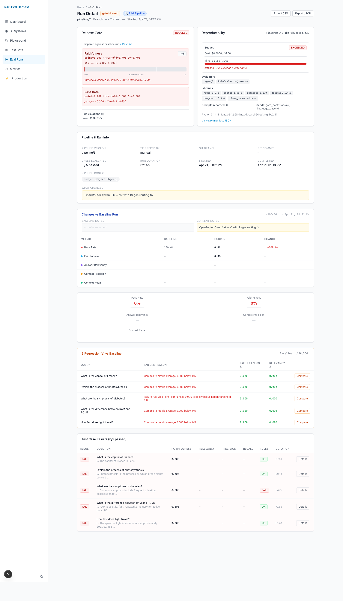
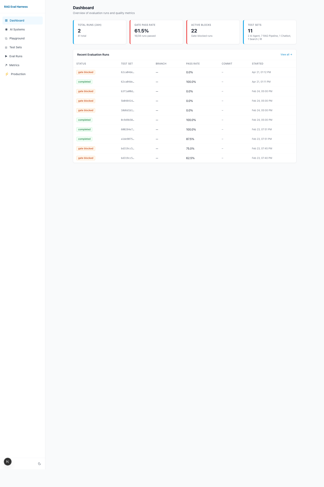
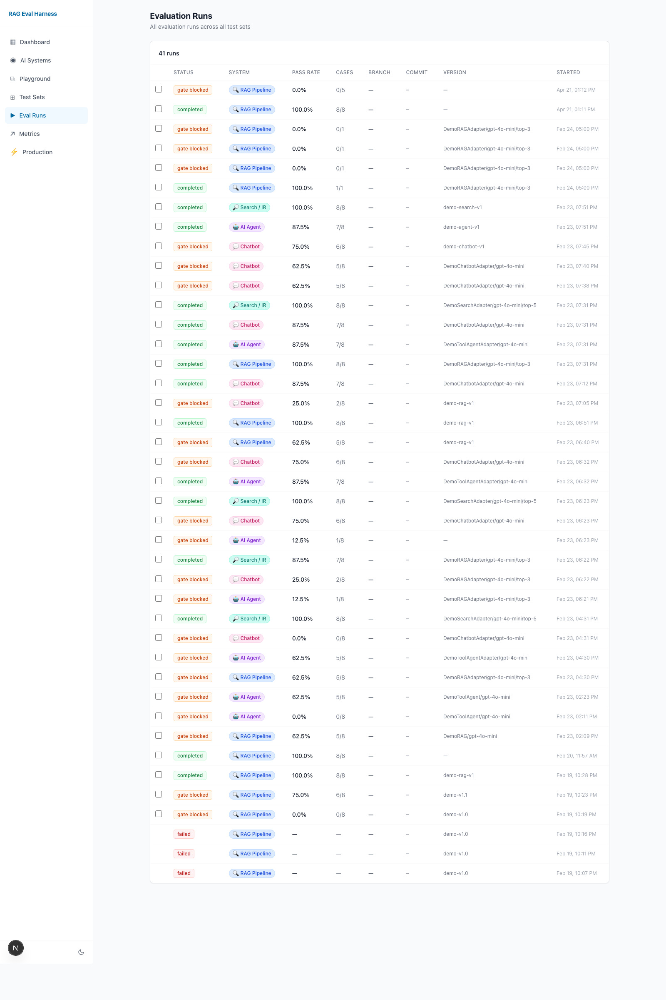
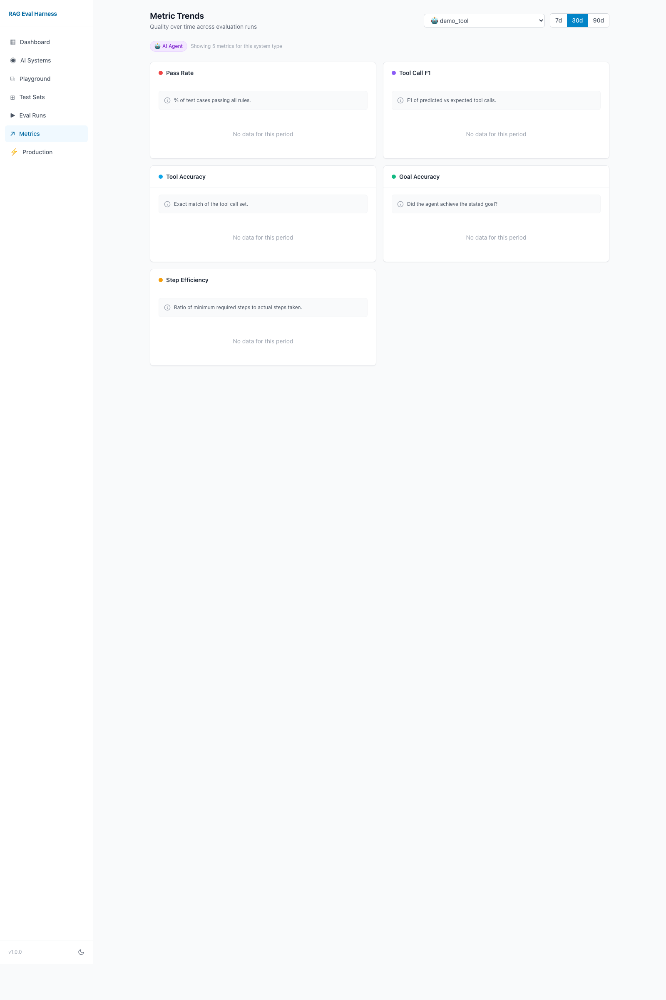
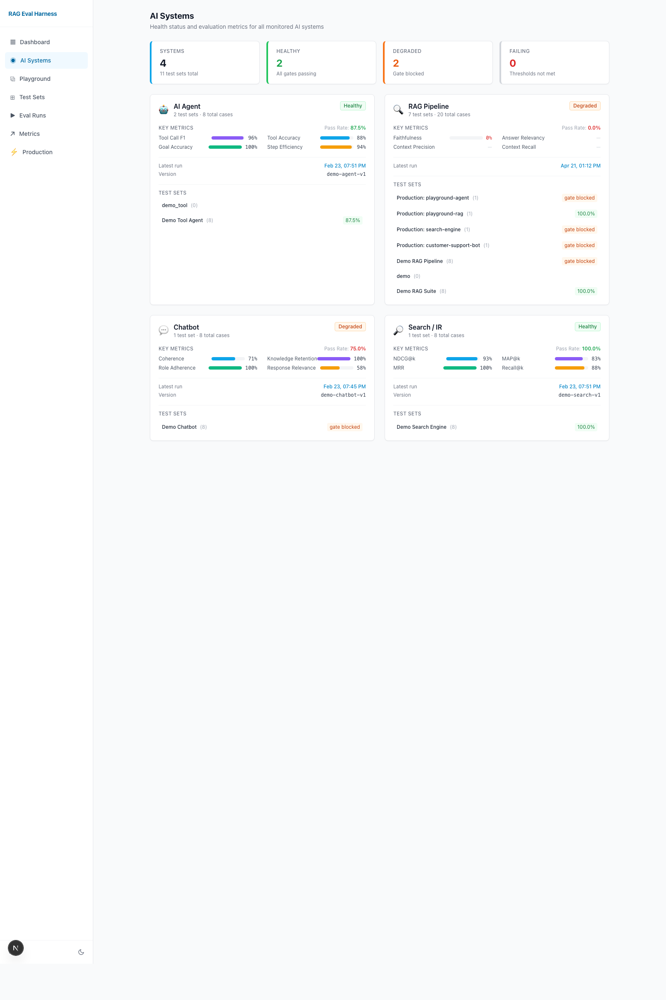

# RAG Eval Harness

**Evaluation-first CI/CD for RAG pipelines, AI agents, chatbots, and search engines.**

   

LLM applications fail silently — a prompt tweak can drop faithfulness 15 points and no unit test catches it. This project treats evaluation like any other CI check: every pipeline change is automatically scored on 19 metrics and **blocked when the regression is statistically significant** vs. the last passing baseline.



*↑ Real run: the significance-aware gate blocking a deploy. Left panel shows the 95% bootstrap CI lower bound below threshold (p<0.05 vs. baseline). Right panel shows the reproducibility manifest (evaluator versions, library versions, seeds, budget). Judge: Qwen 3.6 Plus via OpenRouter.*

---

## What makes it different

| | Naive eval libraries | This project |
|---|---|---|
| Metrics | ✅ | ✅ (19 evaluators) |
| Release gate in CI | ❌ | ✅ blocks PRs on regression |
| Noise-aware gating | ❌ threshold-only | ✅ bootstrap CI + Mann-Whitney U |
| Run reproducibility | ❌ | ✅ manifest with fingerprint |
| Cost control | ❌ | ✅ per-run $ + time budget |
| Provider-agnostic judges | ❌ OpenAI only | ✅ OpenRouter routing |

---

## Highlights

- **Statistically significant release gate.** Bootstrap 95% CI + Mann-Whitney U vs. last passing baseline. Blocks only on `p<0.05` regressions — eliminates false positives from sample noise.
- **19 evaluators.** RAG (Ragas faithfulness, claim-level citation), agents (tool trajectory with edit distance), classification (F1, MCC, Cohen's kappa), LLM-as-judge (self-consistency, G-Eval), safety (regex → Presidio → Llama Guard), calibration (ECE), robustness (paraphrase + adversarial). [Full catalogue →](./EVALUATORS.md)
- **Reproducibility manifest.** Every run pins evaluator versions, prompt hashes, library versions, and seeds into a 16-char fingerprint. Two runs with the same fingerprint reproduce the same gate decision.
- **Provider-agnostic LLM client.** Setting `OPENROUTER_API_KEY` auto-routes every judge through open-source models (Qwen 3.6 Plus, Kimi K2.6, DeepSeek V3.2) — **~10× cheaper** than GPT-4o with comparable judge-human agreement.
- **Cost + time budget.** Per-run ceilings; partial-run behavior so a breach saves what was evaluated instead of failing outright.
- **65 unit tests.** Pure Python, no API required. Backend↔runner parity for statistical helpers pinned by dedicated test.

---

## Architecture

```
 CLI / GitHub Actions ──► FastAPI API ──► Celery Worker ──► Postgres + Redis
         ▲                                    │
         │                                    ├─► 19 evaluators (registry-driven)
         │                                    ├─► Significance gate (bootstrap CI + Mann-Whitney)
         │                                    ├─► Reproducibility manifest
         │                                    └─► Cost + time budget
         │
 Next.js dashboard ◄───── polls API via SWR
```

**Stack:** Python 3.11, FastAPI (async), Celery, PostgreSQL 15 + JSONB, Redis 7, Next.js 14, Tailwind, Recharts, Docker Compose, GitHub Actions.

---

## Quick Start

```bash
git clone https://github.com/aswithabukka/Evaluation-First-Testing-Harness-for-RAG-and-Agents.git
cd Evaluation-First-Testing-Harness-for-RAG-and-Agents

cp .env.example .env                  # add OPENROUTER_API_KEY or OPENAI_API_KEY
docker compose up -d --build          # starts api, worker, db, redis, frontend
docker compose exec api alembic upgrade head
docker compose exec api python -m app.scripts.seed_demo_data
```

Open **http://localhost:3000** — click into any run to see the gate decision panel with live CI bars.

To run unit tests without Docker: `python3 -m pytest runner/tests/ backend/tests/` (65 tests, ~2 s).

---

## Screenshots

| | |
|---|---|
|  |  |
| Dashboard — gate pass rate, recent runs | Runs list — checkbox-select to compare |
|  |  |
| Metric trends with threshold overlays | Health across RAG / Agent / Chatbot / Search |

---

## Documentation

| Doc | Audience |
|---|---|
| **[EVALUATORS.md](./EVALUATORS.md)** | All 19 evaluators explained, plus glossary of BLEU, ROUGE, NDCG, MCC, ECE, bootstrap CI, Mann-Whitney, etc. |
| **[INTERVIEW_PREP_RAG_EVAL.md](./INTERVIEW_PREP_RAG_EVAL.md)** | 850-line self-teaching interview prep — elevator pitches, design decisions, 35 expected questions with answers |
| **[CLAUDE.md](./CLAUDE.md)** | Developer guide — architecture, DB schema, extending the system |
| **[docs/DETAILED_GUIDE.md](./docs/DETAILED_GUIDE.md)** | The long-form README with full feature walkthrough |
| **[rageval.yaml.example](./rageval.yaml.example)** | Config template with all options commented |

---

## Integrating Your Own Pipeline

Implement an adapter:

```python
from runner.adapters.base import RAGAdapter, PipelineOutput

class MyPipeline(RAGAdapter):
    def setup(self):
        self.retriever = MyRetriever()
        self.llm = MyLLM()

    def run(self, query, context) -> PipelineOutput:
        chunks = self.retriever.search(query, top_k=5)
        answer = self.llm.generate(query, chunks)
        return PipelineOutput(answer=answer, retrieved_contexts=chunks)
```

Point `rageval.yaml` at it, and every PR runs the full evaluation.

---

## Author

**Aswitha Bukka** — Data Scientist & ML Engineer
[LinkedIn](https://www.linkedin.com/in/aswithabukka) · [aswithareddybukka@gmail.com](mailto:aswithareddybukka@gmail.com) · [GitHub](https://github.com/aswithabukka)

Built to demonstrate production-grade evaluation infrastructure for LLM applications. Open to full-time Data Scientist / ML / AI Engineer roles.

---

<sub>*"LLM applications fail silently. Evaluation-first CI/CD is how we catch regressions before users do."*</sub>
