# RAG Evaluation Harness: Project Summary And Workflows

## 1. What This Project Is About

This project is an evaluation platform for AI applications, especially RAG pipelines, AI agents, chatbots, and search systems.

The simple explanation:

> It tests an AI system before deployment and blocks the release if the new version performs worse than expected.

It works like unit tests plus a quality dashboard plus a release gate for LLM applications.

Traditional software tests usually check deterministic behavior:

```text
Input: 2 + 2
Expected output: 4
```

LLM applications fail in softer ways:

```text
- The answer sounds correct but is hallucinated.
- The retriever found the wrong documents.
- The model answered a different question.
- The agent called the wrong tool.
- A prompt or model update made quality worse.
- The output became unsafe or inconsistent.
```

This project measures those AI-specific failure modes.

## 2. Main End-To-End Workflow

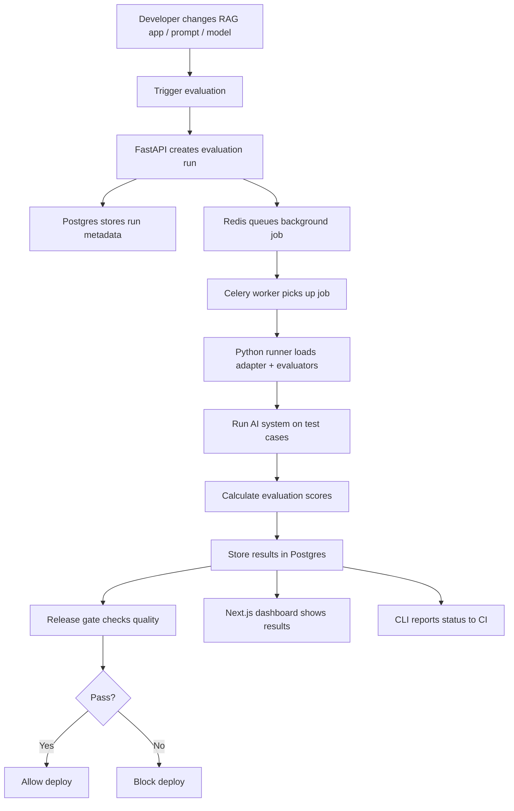

In simple terms:

```text
Trigger evaluation
→ run AI system against test questions
→ score the answers
→ save results
→ decide pass/fail
→ show results in dashboard or CI
```

## 3. Full System Structure

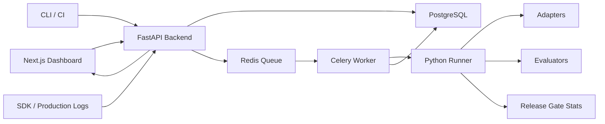

Main responsibility split:

```text
FastAPI coordinates.
Celery executes long jobs.
Python runner evaluates.
Postgres stores permanent data.
Redis queues background jobs.
Next.js displays the results.
CLI automates evaluation from CI/CD.
Docker Compose runs everything locally.
```

## 4. FastAPI Backend

### What FastAPI Is

FastAPI is a Python web framework used to build APIs.

An API lets different parts of the system talk to each other. For example:

```text
GET /runs
POST /runs
GET /metrics/gate/{run_id}
POST /test-sets
```

### Why FastAPI Is Used

FastAPI is used because it is:

```text
- Python-native
- async-friendly
- good with Pydantic validation
- fast to develop with
- good for structured APIs
- compatible with the Python evaluation ecosystem
```

### FastAPI Workflow

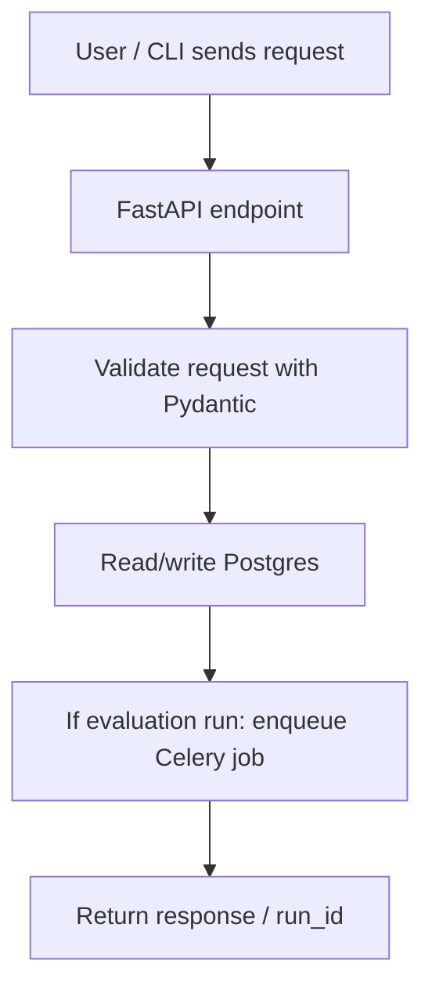

### What FastAPI Handles In This Project

```text
- Test sets
- Test cases
- Evaluation runs
- Evaluation results
- Metrics
- Production ingestion
- Playground
- Health checks
```

### One-Line Interview Explanation

> FastAPI is the backend API layer. It exposes endpoints for managing test sets, runs, results, metrics, and production logs. It creates evaluation runs, stores metadata in Postgres, dispatches Celery jobs, and serves results back to the dashboard or CLI.

## 5. Celery Worker

### What Celery Is

Celery is a Python background job system.

It has three main concepts:

```text
Task: A function that should run in the background.
Queue: A waiting line of jobs.
Worker: A process that picks jobs from the queue and runs them.
```

### Why Celery Is Used

Evaluation jobs can take a long time because they may:

```text
- load many test cases
- call a RAG pipeline
- call LLM judges
- calculate metrics
- store results
- compare against baselines
- send alerts
```

This should not happen inside a normal FastAPI request.

### Celery Workflow

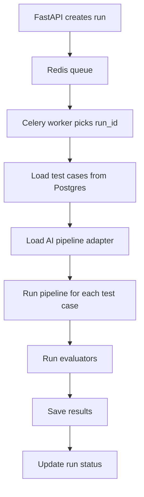

### Celery Beat

Celery Beat is the scheduler. It can run periodic jobs, such as evaluating sampled production traffic every hour.

### One-Line Interview Explanation

> Celery is the background execution layer. FastAPI creates a run and queues the job, while Celery performs the heavy evaluation work: running the AI pipeline, scoring outputs, storing results, and updating the run status.

## 6. PostgreSQL And Redis

### PostgreSQL

PostgreSQL is the permanent database.

It stores:

```text
- Test sets
- Test cases
- Evaluation runs
- Evaluation results
- Metric history
- Production logs
- Reproducibility manifests
- Budget summaries
```

### Postgres Data Relationship

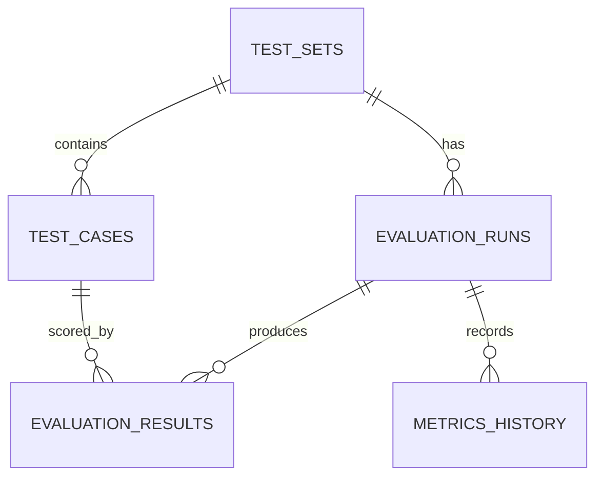

### Why PostgreSQL Is Used

Postgres is good for:

```text
- reliable permanent storage
- relational data
- filtering and querying
- dashboard queries
- finding last passing baseline runs
- storing flexible JSONB fields
```

JSONB is useful because evaluator outputs and configs can evolve over time without needing a new database column for every metric.

### Redis

Redis is used mainly as the Celery message broker and result backend.

It temporarily stores jobs waiting for workers.

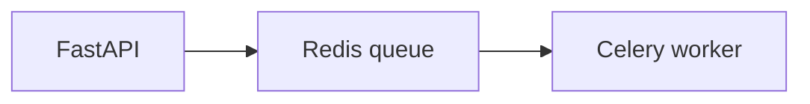

### PostgreSQL vs Redis

| Tool | Role |
|---|---|
| PostgreSQL | Permanent system of record |
| Redis | Temporary queue/message broker |
| PostgreSQL | Stores runs, results, test cases, metrics |
| Redis | Passes jobs from FastAPI to Celery |

### One-Line Interview Explanation

> PostgreSQL stores the official evaluation data, while Redis is the fast queue that passes background jobs from FastAPI to Celery.

## 7. Python Runner

### What The Python Runner Is

The Python runner is the evaluation engine of the project.

FastAPI coordinates requests. Celery runs jobs. Postgres stores data. Redis queues jobs. But the Python runner knows how to actually evaluate AI outputs.

### Python Runner Workflow

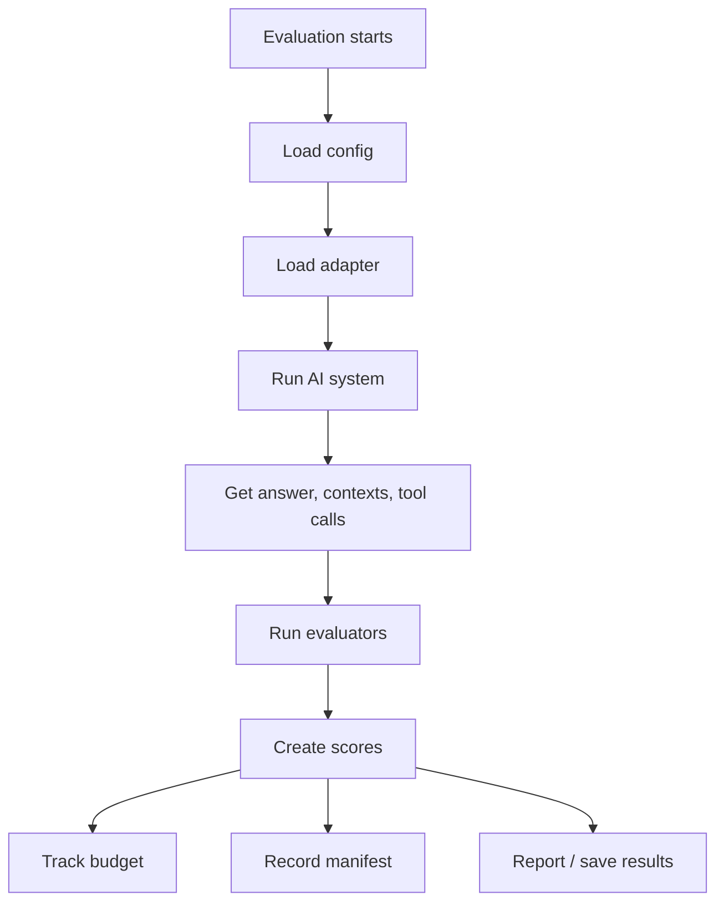

### Python Runner Components

| Component | What It Is | What It Does In This Project |
|---|---|---|
| CLI | Command-line tool | Lets developers or CI trigger evaluations, check gates, and generate reports |
| Config Loader | YAML configuration reader | Reads `rageval.yaml` to know which pipeline, test set, metrics, thresholds, judge model, and budget to use |
| Adapters | Python classes that connect external AI systems to this harness | Let the project run any RAG pipeline, chatbot, agent, or search system in a standard format |
| Base Adapter | Required interface every adapter must follow | Defines that every pipeline should return an answer, retrieved contexts, tool calls, conversation history, and metadata |
| Evaluators | Metric/scoring modules | Calculate scores such as faithfulness, answer relevancy, context precision, context recall, safety, robustness, and tool accuracy |
| Evaluator Registry | Mapping of metric names to evaluator classes | Lets the system choose evaluators from config by name instead of hard-coding them |
| Reporters | Output formatters | Convert evaluation results into console output, JSON reports, or diff reports |
| Gate Stats | Statistical helper functions | Calculates confidence intervals and regression significance for release decisions |
| Budget | Cost and time tracking logic | Stops or marks a run partial if evaluation exceeds a dollar or time limit |
| Manifest | Reproducibility record | Stores evaluator versions, prompt hashes, model details, seeds, library versions, and commit SHA |
| Plugins | Extension mechanism | Allows custom evaluators or domain-specific metrics |
| Multi-turn Support | Logic for conversations or agents over multiple steps | Evaluates systems where behavior depends on prior turns or tool/action sequences |
| Tests | Automated test files | Check that runner components work correctly |

### One-Line Interview Explanation

> The Python runner is the reusable evaluation engine. It contains the CLI, config loader, adapters, evaluators, reporters, statistical gate helpers, budget controls, and reproducibility manifest.

## 8. Evaluation Registry

### What It Is

The evaluation registry is a mapping between evaluator names and evaluator classes.

Example:

```python
EVALUATOR_REGISTRY = {
    "ragas": RagasEvaluator,
    "llm_judge": LLMJudgeEvaluator,
    "g_eval": GEvalEvaluator,
    "pairwise": PairwiseEvaluator,
    "citation": CitationEvaluator,
    "trajectory": TrajectoryEvaluator,
    "robustness": RobustnessEvaluator,
    "calibration": CalibrationEvaluator,
    "safety": SafetyEvaluator,
}
```

### Registry Workflow

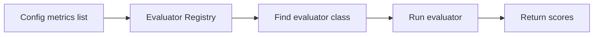

### Why It Is Used

Without the registry, the system would need a large hard-coded if/else chain.

The registry makes it easy to:

```text
- add new evaluators
- enable evaluators from config
- keep worker code cleaner
- support different AI system types
```

### One-Line Interview Explanation

> The evaluator registry is the lookup table that tells the system which evaluator to run for each metric name.

## 9. RAG Metrics

### What RAG Metrics Evaluate

RAG has two main parts:

```text
Retrieval: Find useful documents/context.
Generation: Use that context to write an answer.
```

RAG metrics check both parts.

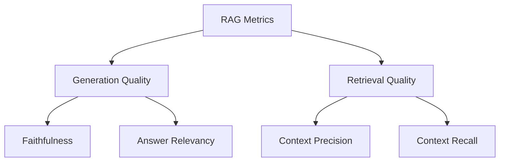

### Main RAG Metrics

| Metric | What It Checks |
|---|---|
| Faithfulness | Is the answer supported by the retrieved context? |
| Answer Relevancy | Does the answer actually respond to the user question? |
| Context Precision | Are the retrieved chunks mostly useful/relevant? |
| Context Recall | Did we retrieve enough of the needed information? |

### How They Are Calculated

The project uses the Ragas library for the core RAG metrics.

The inputs passed to Ragas are:

```text
question
answer
contexts
ground_truth
```

Conceptually:

```text
Faithfulness:
supported claims / total answer claims

Answer Relevancy:
how well the answer matches the question intent

Context Precision:
relevant retrieved chunks / retrieved chunks

Context Recall:
ground-truth facts found in context / total ground-truth facts
```

### RAG Metrics Workflow

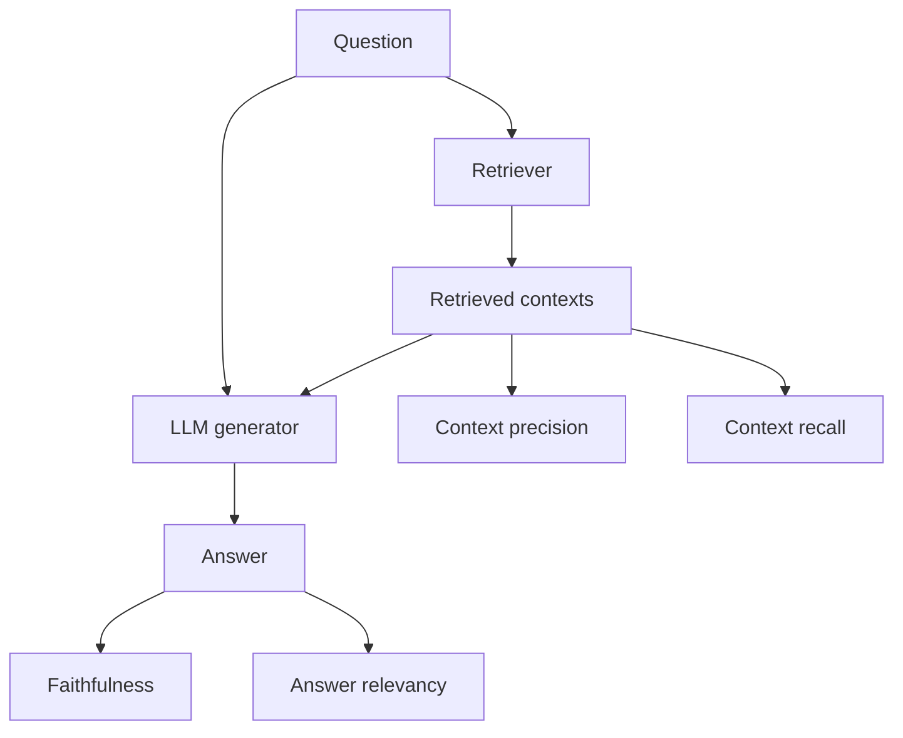

### One-Line Interview Explanation

> For RAG, I separated evaluation into retrieval quality and generation quality. Context precision and recall evaluate retrieval. Faithfulness and answer relevancy evaluate generation.

## 10. LLM Judges

### What An LLM Judge Is

An LLM judge uses another language model to evaluate the output of the AI system.

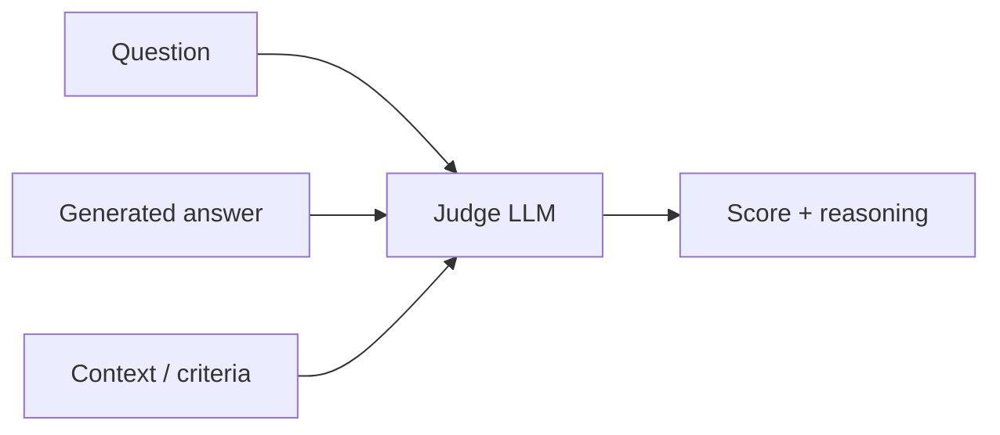

### Why LLM Judges Are Used

Some qualities are hard to score with fixed formulas:

```text
- helpfulness
- coherence
- completeness
- tone
- groundedness
- instruction following
- overall quality
```

### Shared LLM Client

The project uses a shared LLM client that handles:

```text
- JSON output
- retries
- error classification
- caching
- cost tracking
- latency tracking
- OpenAI/OpenRouter-compatible routing
- concurrency limits
```

### Risks

LLM judges can have:

```text
- bias
- inconsistency
- verbosity preference
- position bias
- model drift
- JSON parsing failures
```

The project reduces these risks with self-consistency, prompt hashing, retries, caching, calibration, manifest tracking, and cost tracking.

### One-Line Interview Explanation

> LLM judges are used for subjective quality dimensions, but the project treats them as noisy measurement tools and adds retries, caching, JSON validation, calibration, and reproducibility tracking.

## 11. Bootstrap Confidence Interval

### What It Answers

Bootstrap answers:

> Is the current run confidently above the required threshold?

### Example With 8 Questions

Suppose we have 8 current faithfulness scores:

```text
0.77, 0.82, 0.79, 0.80, 0.83, 0.78, 0.81, 0.76
```

Mean:

```text
0.795
```

Threshold:

```text
0.80
```

Naive decision:

```text
0.795 < 0.80, so fail.
```

But this is very close, so bootstrap estimates uncertainty.

### Bootstrap Steps

1. Start with the real scores.
2. Randomly resample 8 scores with replacement.
3. Calculate the average for that fake sample.
4. Repeat many times, such as 2000 times.
5. Sort all fake averages.
6. Take the middle 95% range as the confidence interval.

Example confidence interval:

```text
0.777 to 0.813
```

Since the lower bound is below the threshold:

```text
0.777 < 0.80
```

The model is not confidently above the threshold.

### One-Line Explanation

> Bootstrap tells us how stable the current average score is by repeatedly resampling the observed scores.

## 12. Mann-Whitney U Test

### What It Answers

Mann-Whitney answers:

> Is the current run significantly worse than the previous passing baseline?

### Example

Baseline scores:

```text
0.88, 0.90, 0.84, 0.86, 0.91, 0.89, 0.87, 0.85
```

Current scores:

```text
0.77, 0.82, 0.79, 0.80, 0.83, 0.78, 0.81, 0.76
```

All current scores are lower than all baseline scores.

Mann-Whitney asks:

```text
Are current scores consistently lower than baseline scores?
```

### Simple Way To Understand It

Compare every current score against every baseline score.

With 8 current and 8 baseline scores:

```text
8 × 8 = 64 comparisons
```

If current scores almost never beat baseline scores, that is strong evidence of regression.

### What The p-value Means

The p-value answers:

> If there was no real difference between current and baseline, how surprising would this result be?

Example:

```text
p = 0.00015
```

This means the observed separation is very unlikely to happen randomly.

Decision rule:

```text
p < 0.05 and current is lower → statistically significant regression
p >= 0.05 → not enough evidence of real regression
```

### One-Line Explanation

> Mann-Whitney tells us whether the current scores are truly worse than the baseline scores, not just slightly different by chance.

## 13. Release Gate

### What The Release Gate Does

The release gate decides whether the new AI system version can be deployed.

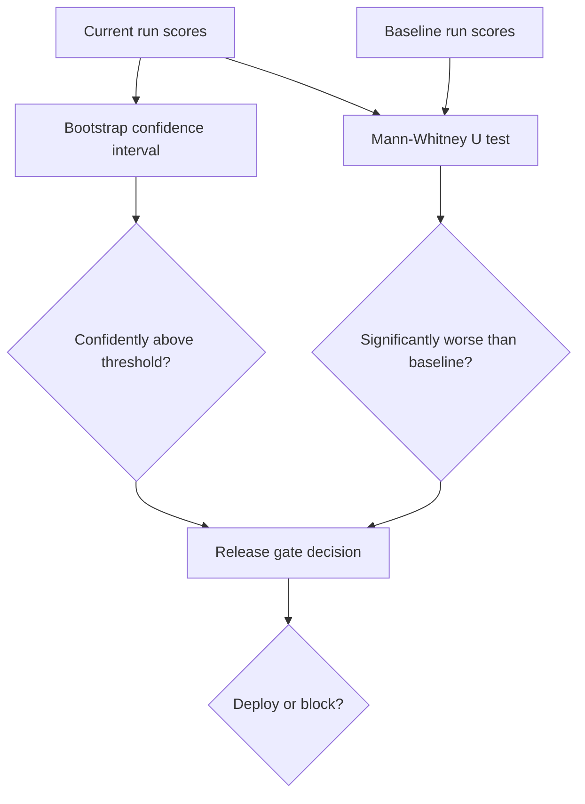

### Why It Is Used

AI eval scores are noisy. A tiny drop may be random.

The release gate helps avoid:

```text
- blocking releases due to random noise
- allowing real quality regressions into production
```

### One-Line Interview Explanation

> The release gate uses thresholds plus statistical checks like bootstrap confidence intervals and Mann-Whitney U tests to block meaningful regressions while avoiding false alarms from random score movement.

## 14. Next.js Dashboard

### What Next.js Is

Next.js is a React framework used to build web applications.

### What The Dashboard Does

The dashboard visually shows:

```text
- test sets
- test cases
- evaluation runs
- failed cases
- metric trends
- release gate status
- production logs
- system health
```

### Dashboard Workflow

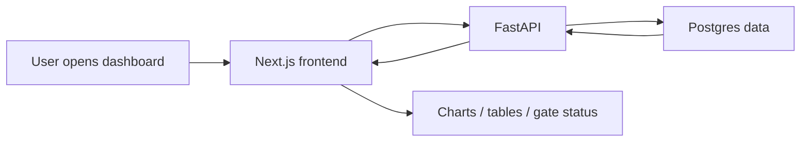

### One-Line Interview Explanation

> The Next.js dashboard is the visual layer for inspecting evaluation runs, failures, trends, metrics, and gate decisions.

## 15. CLI

### What The CLI Is

The CLI is the command-line interface.

It lets developers and CI/CD systems use the project without opening the dashboard.

Main commands:

```text
rageval run
rageval gate
rageval report
rageval calibrate
```

### CLI Workflow

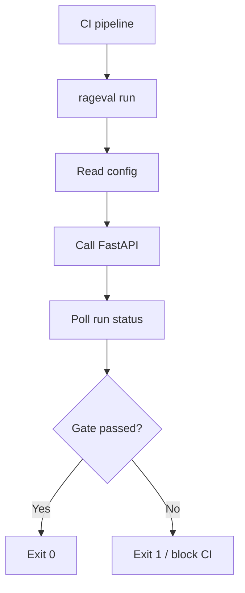

### One-Line Interview Explanation

> The CLI connects the evaluation harness to CI/CD by triggering runs, checking gate results, and failing builds when quality regresses.

## 16. Docker Compose

### What Docker Compose Is

Docker Compose is used to run multiple services together locally.

### Services In This Project

```text
api       → FastAPI backend
worker    → Celery worker
beat      → Celery scheduler
db        → PostgreSQL
redis     → Redis
frontend  → Next.js dashboard
migrate   → Alembic database migrations
```

### Docker Compose Workflow

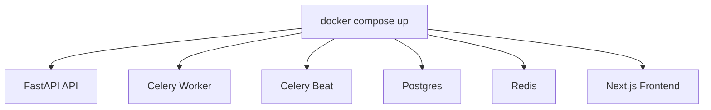

### One-Line Interview Explanation

> Docker Compose makes local development easy by starting the API, worker, scheduler, database, Redis, and frontend together with one command.

## 17. Final Interview Summary

Use this when someone asks you to describe the project:

> This project is an evaluation-first CI/CD platform for RAG and LLM applications. A user or CI pipeline triggers an evaluation through FastAPI or the CLI. FastAPI stores the run in Postgres and queues a Celery job through Redis. The Celery worker uses the Python runner to load the AI pipeline adapter, run test cases, calculate metrics such as faithfulness, answer relevancy, context precision, and context recall, and store results. The release gate then uses thresholds plus statistical checks like bootstrap confidence intervals and Mann-Whitney U tests to decide whether the new version passes or should be blocked. The Next.js dashboard visualizes runs, failures, metrics, trends, and gate decisions.

